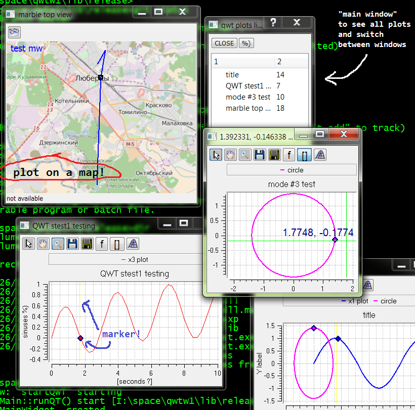
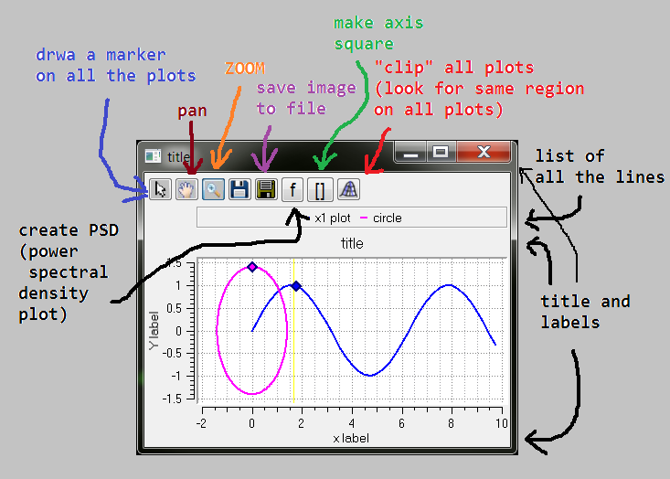
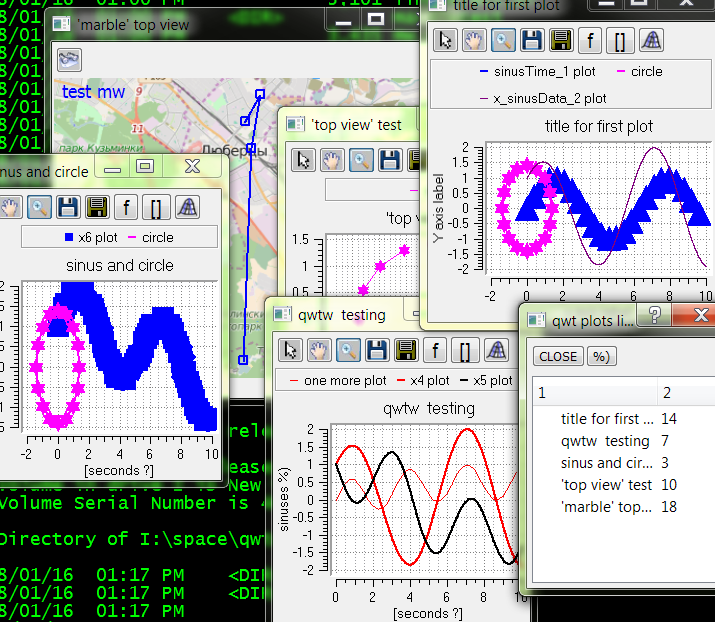

# qwtw 
another qwt-based 2D plotting library

This is a [library header file](https://github.com/ig-or/qwtw/blob/master/qwtw/c_lib/qwtw.h)

And this is a [small example how to use it](https://github.com/ig-or/qwtw/blob/master/qwtw/qwtwtest.cpp)

This is a small page with description of some useful features of this library: https://github.com/ig-or/qwtw/wiki/qwtw-library-features

If you need something in this library which is not implemented yet, feel free to implement it! %) Or at least write me about it - may be I'll be able to add the features you need.

##### Settings 
are stored in ~/.qwtw/settings.json file. In rare cases you may want to update this file manually. 
 * pickerDigitsNumber is the number of digits (with pointer coordinates) displayed near mouse cursor when you press left mouse button on a plot window

 

